# **Note - Java**

## **一 Java概述**

* javac命令编译为字节码.class文件，java命令执行.class字节码，解释型执行

* Java是面向对象的解释型语言，与C语法类似，但抛弃了令人困惑的语法：重载运算符，多继承等，指针改为引用。

* Java只支持类class间的单继承，但可支持接口interface间的多继承。

* **接口interface，仅定义派生要用到的方法，而方法的具体实现取决于派生类，在继承中扮演重要的角色**。

---

## **二 Java面向对象概述**

* **继承extends**


* **多态polymophism**

**方法重载：**一个类中定义了多个**方法名相同**,而他们的参数的数量不同或数量相同而类型和次序不同

**方法重写**：方法重写是在子类存在方法与父类的方法的名字相同,而且参数的个数与类型一样,返回值也一样的方法。重写可能有**@Override的标识符**。

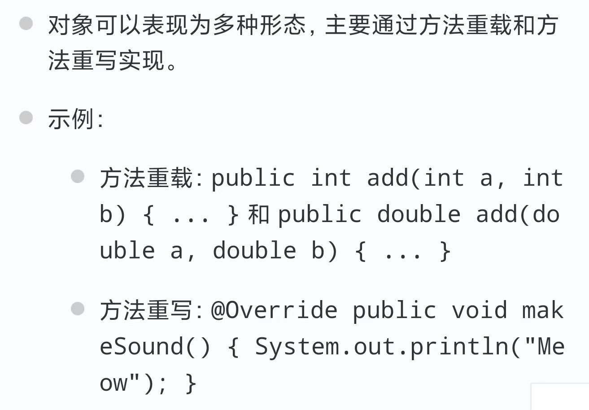

* **抽象与接口**

其中接口支持多重继承，定义一些Drivable等特性


* **源文件及包**

除下面的要求以外，.java文件的名称应与public对应的类名相同

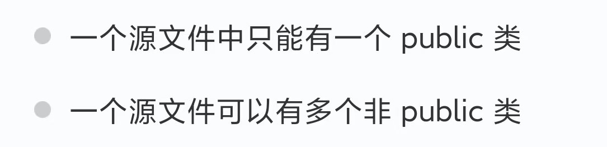

---

## **三 Java数据与变量类型**

分为内置数据类型与引用数据类型.


  * **内置数据类型**：

byte short int float double boolean char

  * **引用数据类型**：


  * **值传递与引用传递**

对象默认为引用传递，基本数据类型为值传递.

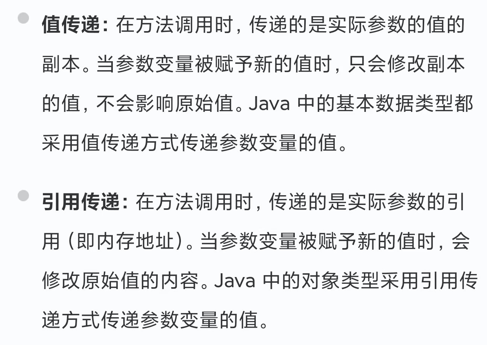

  * **Java的常量**

在Java中使用final关键字来修饰常量，通常全大写来命名变量.

  * **访问控制修饰符**

1.主要分为private public 与 protected. 

2.default 为包级别，也即只能被同一包中的其他类访问.

3.类和接口不能使用private修饰，类不能用protected修饰


上述几种修饰符的约束条件：

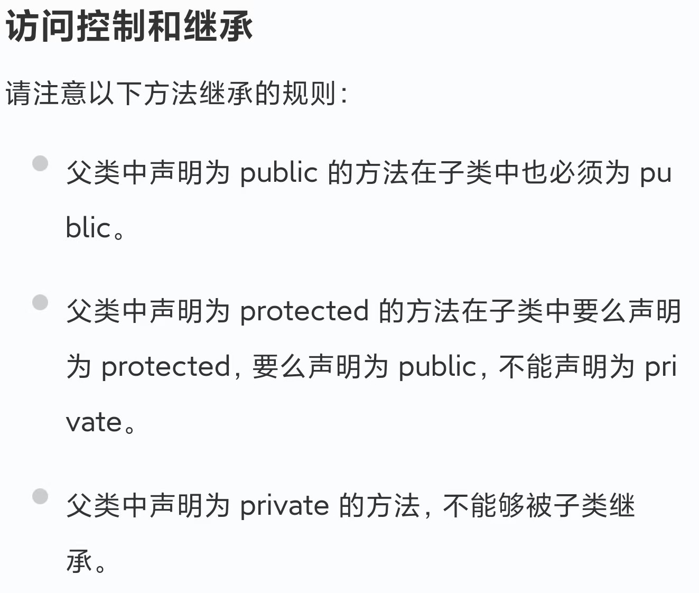

---

## **四 Java中的各种类**

a. **Number&Math类**

        1. **Java 语言为每一个内置数据类型提供了对应包装类（Integer、Long、Byte、Double、Float、Short）**，都是抽象类 Number 的子类~(初始化Number类变量时需要new)~

​    I. Java 的 Math 包含了基本数学运算的属性和方法(floor round ceil)，Math 的方法都被定义为 static 形式，通过 Math 类可以在主函数中直接调用

​    II. 实际上，Java提供装箱(基本类型到包装类型)与拆箱操作(反之)

b. **Character类**

​    I. 包含isLetter() isxxx()... toxxx()...等具体操作，具体函数请查询Java文档

c. **String与StringBuffer类**

​    I. String类无法被修改而StringBuffer/StringBuilder类对象可以被修改.

​    II. StringBuilder与StringBuffer间区别为是否线程安全，后者安全而前者效率更高，具体方法见JavaAPI文档

d. **Scanner类**

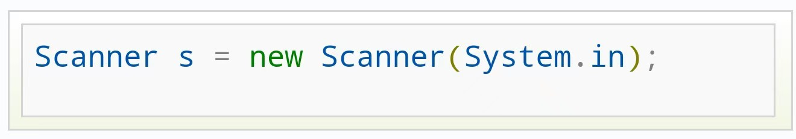

​    I. 程序可以通过java.util.Scanner类来获取用户的输入，上面是创建一个Scanner对象的基本语法.

​    II. **next() 与 nextLine() 方法获取输入的字符串**，在读取前我们一般需要 使用 hasNext 与 hasNextLine 判断是否还有输入的数据.


* **Tips：next()与nextline()的异同**

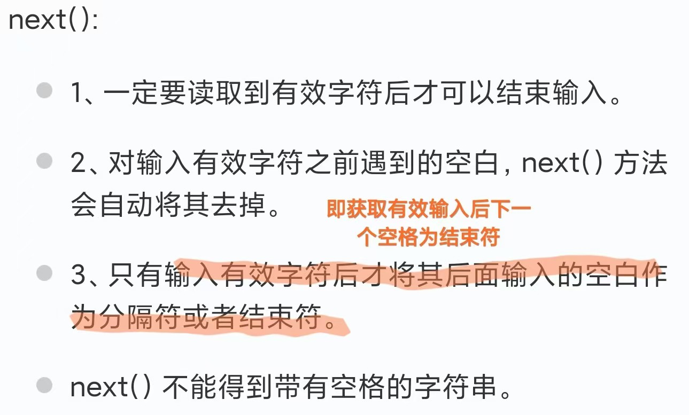

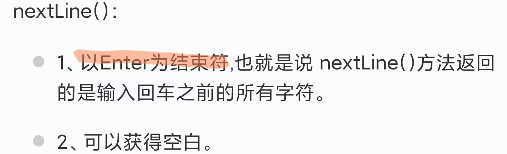

* **Tips：对基本数据类型，存在hasNextxxx()与nextxxx()等函数，比如Int Double**

### e. **Object类**

Object 类是所有类的父类，位于自动导入的 java.lang 包中，若未明确继承父类，将隐式继承 Object类.

-  包含clone(),hashcode(),equals() ,wait()等方法.


---

## **五 Java数组**

  * **数组声明与初始化**

上方为Java风格的数组定义，下方为C风格的数组定义，建议使用前者.

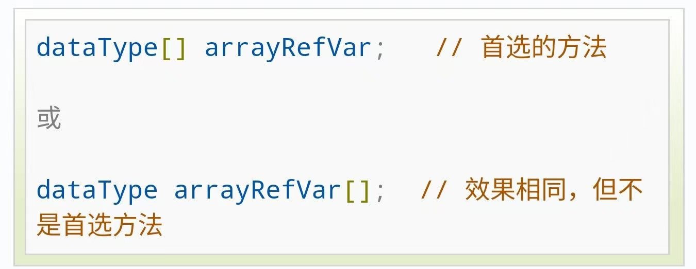

创建数组时，可以使用枚举的方法{4，1，2}，也可以使用new的方法.

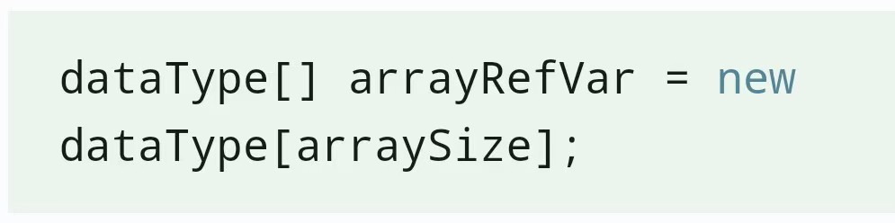

  * **数组为引用传递**

---

## **六 调用与构造函数**

  * 运行一个程序时候再传递给它消息。这要靠传递命令行参数给main()函数实现(在编译命令中在 javac后->java时添加命令行参数)

  * 类中构造函数的特点有：**与类名相同且没有返回类型**，**支持子类super调用(但不能被继承)**，**自动调用(使用 new 创建对象时)，使用this表示实例对象自身**

  * *建议手动写上空参与有参的全部的构造方法*


---

## **七 Java面向对象**

  * **Javabean框架类** -- 描述一类事物的类，在Javabean类中，是不写main方法的！


  * **对象内存图**

​	展示对象如何在内存各分区（堆、栈、方法区）中分布。

​	**.class即.java文件经编译过后的字节码文件，使用某类时，需加载到方法区。**


  * **Java继承**
    * **extends关键字**

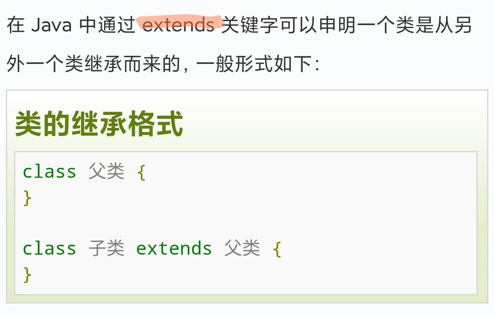

* **继承中子类与父类的关系**
           1. **子类拥有父类非 private 的属性、方法**。
           2. 子类可以拥有自己的属性和方法，即子类可以对父类进行扩展。
           3. 子类可以用自己的方式实现父类的方法。
        4. **子类是不继承父类的构造器（构造方法或者构造函数）的**，它只是调用–
              - 当父类为~非参数构造器时，隐式调用~；
              - 为~参数构造器时，显式调用~


* **implements关键字**
           1. **Java在设计父类时，不允许使用多继承，但implements 关键字可以变相的使java具有多继承的特性**(**接口**)
               2. 如下图，即为一个多继承接口的实例

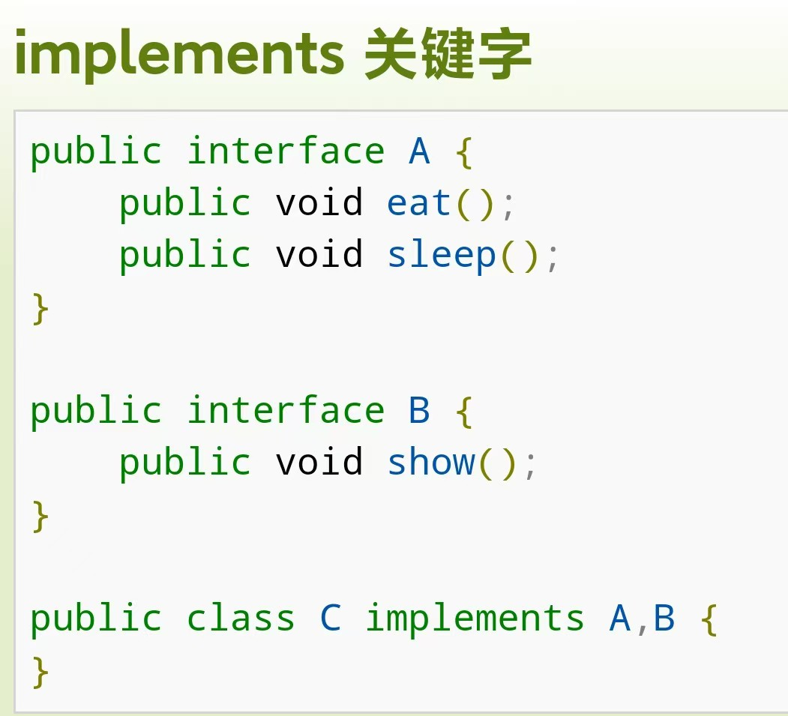

* **super 与 this 关键字**
   1. super 关键字：可以通过 super 关键字来实现对父类成员的访问，用来引用当前对象的父类
   2. **this 关键字：区分局部变量与成员变量，代表方法调用者的地址值。（原理图见对象内存图）**

​    

  * **Java多态**

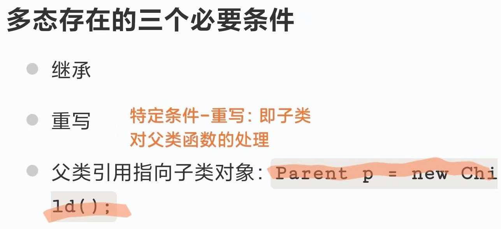

* 当**使用多态方式调用方法时，首先检查父类中是否有该方法，如果没有，则编译错误；如果有，再去调用子类的同名方法**。

* 要想调用父类中被重写的方法，则必须使用关键字 super


  * **Java抽象类**
    * 抽象类不能实例化对象，被继承，才能被使用
    
    * 在 class 前添加 **abstract** 关键字定义抽象类
    
    * **抽象方法：**
    
        1. Abstract 关键字同样可以用来声明抽象方法，**抽象方法只包含一个方法名，而没有方法体**
        
        2. 如果一个类包含抽象方法，那么该类必须是抽象类


  * **Java接口**

        I. 定义：**接口是抽象方法的集合**，一个类通过继承接口的方式，从而来继承接口的抽象方法

        II. **特点**：

        1. **接口无法被实例化，但是可以被实现**

        2. **一个实现接口的类，必须实现接口内所描述的所有方法，否则就必须声明为抽象类**

        3. 接口是隐式抽象的，当声明一个接口及其方法时，不必使用abstract关键字

        4. 接口中的方法都是**公有的**

      

      III. **接口的声明与实现**

​	**声明**：可见度即public等限定关键字


​	**实现：在class的声明后增加implements关键字**


​	**标记接口**

​		没有任何方法和属性的接口.**仅仅表明它的类属于一个特定的类型**(例如awt包里的MouseEvent接口，接口体为空)

---

## **八 Java 文件组织**

* **Java包 (Package)**

路径应该是 **pkg1/pkg2/pkg3/xxx.java**


- **Java中常用pkg**

java.lang-打包那些最基础的类

java.io-包含输入输出功能的函数

- **import关键字**

import 关键字用于导入其他类或包中定义的类型，以便在当前源文件中使用这些类型

## **九 Java数据结构**

  * **数组Arrays**

​	存储固定大小的相同类型的元素，随机访问元素效率高，但大小固定，插入和删除元素较慢

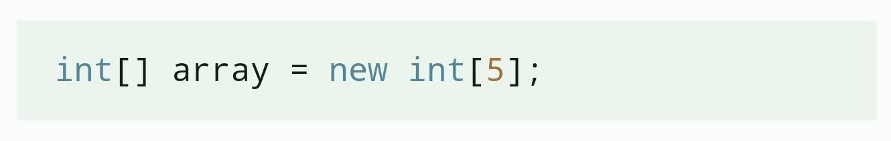

  * **列表Lists**

​	Java 提供了多种列表实现，如 ArrayList 和 LinkedList


​	下面是ArrayList与LinkedList的使用实例

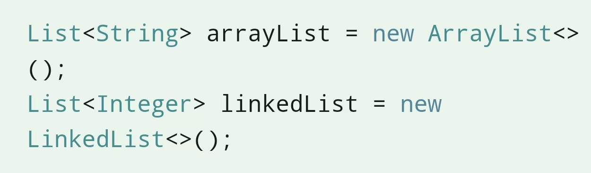

  * **集合 Sets**

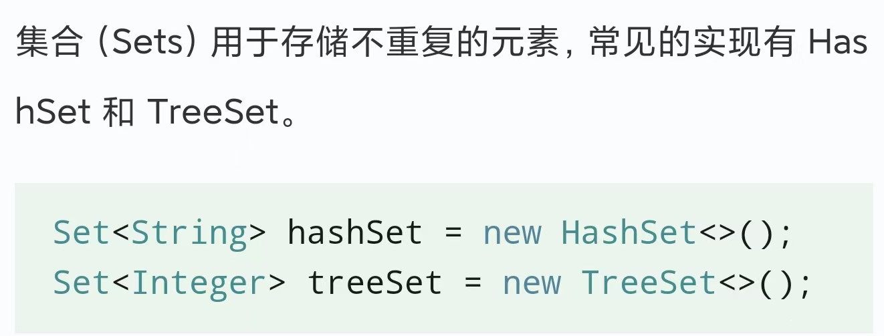

  * **映射 Maps**

​	用于存储键值对，常见用**HashMap(基于哈希表)与TreeMap(基于红黑树)**来实现Maps


​	此外还有优先队列(堆)PriorityQueue<>，队列Queue<>常见的实现有 LinkedList 和 PriorityQueue，栈Stack<>等等，细节请参考Java文档

---

## **十 Java集合框架**

​	Java 集合框架主要包括两种类型的容器：

​	**一种是集合（Collection），存储一个元素集合；另一种是图（Map），存储键/值对映射。**

​	**Collection 接口又有 3 种子类型，List、Set 和 Queue**，再下面是一些抽象类，最后是具体实现类，**常用的有 ArrayList、LinkedList、HashSet、LinkedHashSet、HashMap、LinkedHashMap** 等等。


#### **内置集合类**

##### 1. **ArrayList数组队列**


  * 常用方法：add()，remove()，.size()，set(index,content)

  * **ArrayList 中的元素实际上是对象,<E>中的数据类型为基本类型的包装类**

  * ArrayList**排序一般使用Collections类的sort：Collections.sort(sites)**;


##### 2. **LinkedList链表**

* 与 ArrayList 相比，LinkedList 的增加和删除的操作效率更高，而查找和修改的操作效率较低 (即链表和数组的比较)

* **常用方法：add(),addFirst(),remove(),removeFirst(),get()**

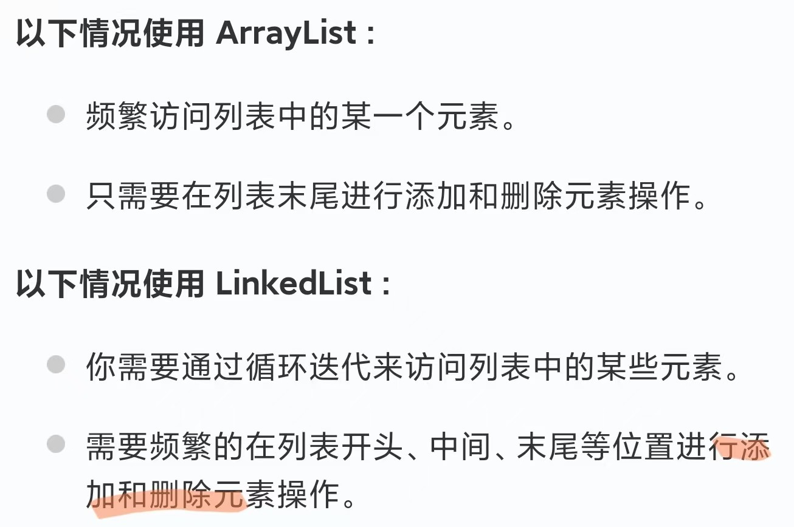

##### 3. **HashSet哈希集合(集合)**

##### 4. **HashMap哈希映射(字典)**

##### 5. **Iterator迭代器**

* 迭代器（Iterator）是 Java 集合框架中的一种机制，是一种用于**遍历集合（如列表、集合和映射等）的接口**，提供了一种**统一的方式来访问集合中的元素**

* **初始化迭代器**

​	**`Iterator<String> it = 可迭代对象.iterator();`**

- **常用方法**


-  **实例**


---

## **十一 Java数据流与网络编程**

#### 11.1 **数据流**

> 见《菜鸟教程》https://www.runoob.com/java/java-files-io.html 

主要分为**字节流**与**字符流**两种

| 对比维度      | 字节流（Byte Stream）                                | 字符流（Character Stream）                          |
| ------------- | ---------------------------------------------------- | :-------------------------------------------------- |
| **处理单位 ** | 1 个字节（8 bit）                                    | 1 个字符（16 bit Unicode，含中文、特殊符号）        |
| **核心父类**  | 输入：`InputStream`；输出：`OutputStream`            | 输入：`Reader`；输出：`Writer`                      |
| **适用场景**  | 处理二进制文件（图片、视频、音频、压缩包）、通用 I/O | 处理文本文件（.txt、.java）、字符串传输（避免乱码） |
| **编码依赖**  | 不依赖字符编码（直接操作二进制）                     | 依赖字符编码（如 UTF-8、GBK），需匹配数据源编码     |


#### 11.2 **CS架构网络编程**

> 网络编程包为 `java.net.*`

##### **11.2.1 网络通信三要素**

###### 1. IP地址

- 特殊IP地址：**127.0.0.1（localhost）代表本机IP**
- **InetAddress，Java中封装IP对象类于`java.net.InetAddress`**
  - 

###### 2. 端口

- 端口号为一个**16位的二进制编码**，范围为0~65535
- 周知（0~1023），注册（1024~49151），动态（49152~65535）

###### 3. 协议

- **UDP协议**
  - 无连接（不事先建立连接）
  - 不可靠（发送-接收方**不存在确认机制**）
- **TCP协议**
  - 面向连接：发送-接收方需建立连接
  - **可靠通信：a.三次握手/四次挥手；b.传输数据ACK；c.超时重发**


##### 11.2.2 Socket基础

- **Socket** 就是通信双方的“**逻辑管道**”

- **四元组`  <本地 IP，本地端口，远端 IP，远端端口> `唯一地确定一个`Socket`**

  - 上述约定仅作用于面向连接的TCP协议，后续数据传输都基于这个固定连接

  - 在无连接的UDP中，DatagramSocket仅需绑定本地IP与本地端口，而将远端IP与远端端口动态绑定到DatagramPacket中***（DatagramSocket作为数据收发的固定窗口，DatagramPacket实现“一对多”的灵活通信）***

- 把“复杂的网络”抽象成了“**像文件一样读写**”，复杂机制由OS内核包办

- **“发送-接收”的物理流向**

  ​	数据包到达网卡 → 协议栈根据四元组**哈希查找**对应 `Socket` → 把 `payload` 拷进它的接收缓冲区 → 唤醒阻塞在 `read()` 上的进程。


##### **11.2.3 UDP 网络编程**


- **`DatagramSocket`类**
  - 创建`UDP Socket`对象（扔韭菜的人），存在**指定端口号/随机端口号两种形式**
  - `send()/receive()`进行发送-接收方的数据包传输
- **`DatagramPacket`类**
  - 创建数据包对象（韭菜盘子），发送方创建数据包时，需指定`IP address`与`port`
  - `DatagramPacket`对象中存在`getLength()`(获取所接收报文长度)、`getAddress()`（发送方IP地址）等`get/set`函数


###### * UDP服务端

```java
import java.net.*;
// UDP通信服务器端
public class udp_server{
    public static void main(String[] args) throws Exception{
        System.out.println("-----开启UDP服务端-----");
        // 1、创建UDP服务器端socket
        DatagramSocket ds = new DatagramSocket(10086); // 注册服务端的端口号为10086

        // 2、创建接收数据包的韭菜盘子
        byte[] buffer = new byte[1024*64]; // 创建64kb的字节数组
        DatagramPacket packet = new DatagramPacket(buffer, buffer.length);

        // 3、服务端socket接收发送到当前主机当前port的数据包
        ds.receive(packet);
        String rcv = new String(packet.getData(),0,packet.getLength()); // packet.getData()也可为buffer

        // 读取当前所接收数据包
        System.out.println(rcv);
    }
}
```

###### * UDP客户端

```java
import java.net.*;

// UDP通信客户端
public class udp_client {
    public static void main(String[] args) throws Exception {
        // 1、创建UDP客户端socket
        DatagramSocket ds = new DatagramSocket(); // 若不指定端口号，自动分配一个可用端口

        // 2、创建发向localhost:10086端口的数据包（每个数据包指向某个端口）
        String msg = "Hello, Server!";
        byte[] data = msg.getBytes(); // 将字符串转化为字节数组
        DatagramPacket packet = new DatagramPacket(data, data.length, InetAddress.getLocalHost(), 10086);

        // 3、发送数据包
        ds.send(packet);

        System.out.println("UDP客户端发送完毕！");
    }
}
```


##### 11.2.4 TCP网络编程

###### 1. TCP发送-接收模型


###### 2. `java.net.Socket`类

- **客户端中，需`Socket(String host, int port)`初始化，向对应IP与端口发起Socket连接请求**
- **`Socket`对象使用`SocketObject.getOutputStream()`与`SocketObject.getInputStream()`来获取输出流/输入流的数据（字节输入与输出流不方便使用，可以向上封装为`DataInputStream`等）**
  - InputStream 的语义是“有就返回，没有就阻塞”，不保证一次把你要的 len 读满；
  - OutputStream 的语义是“拷贝到内核发送缓冲区就返回”，不保证对方已收到；


###### 3. `java.net.ServerSocket`类

- **服务端中，需 `ServerSocket(int port)` 注册当前服务端程序端口**
- **服务端中，利用 `ServerSocketObject.accept()` 阻塞服务端程序，并返回服务端对应的Socket对象**


###### 4. 与多个客户端同时通信的服务端


###### * TCP 客户端

```java
import java.net.Socket;
import java.net.InetAddress;
import java.net.UnknownHostException;
import java.util.Objects;
import java.util.Scanner;

public class tcp_client {
    public static void main(String[] args) throws Exception {
        // 1、创建TCP客户端socket，申请与Localhost:10086端口的连接
        Socket socket = new Socket(InetAddress.getLocalHost(),10086);

        Scanner sc = new Scanner(System.in);
        System.out.println("请输入要发送的消息：");
        String msg = sc.nextLine();

        while (!Objects.equals(msg, "exit")) {
            // 2、获取socket的输出流，向服务器端发送数据
            socket.getOutputStream().write(msg.getBytes());
            // 重新获取用户数据输入
            System.out.println("请输入要发送的消息：");
            msg = sc.nextLine();
        }
        // 3、关闭客户端socket
        socket.close();
    }
}

```

###### * TCP 服务端

```java
import java.io.IOException;
import java.io.InputStream;
import java.net.ServerSocket;
import java.net.Socket;

public class tcp_server {
    public static void main(String[] args) throws IOException {
        System.out.println("---服务器端启动---");
        // 1、注册服务器端socket，监听10086端口
        ServerSocket serverSocket = new ServerSocket(10086);

        // 循环接收客户端连接
        while (true) {
            // 2、等待多客户端连接，获取下一用户socket连接
            Socket serversocket = serverSocket.accept();
            System.out.println(serversocket.getRemoteSocketAddress() + " 连接成功");
            // 3、创建线程对象，启动线程
            new tcpServerReaderThread(serversocket).start();
        }
    }
}

```


###### * TCP 服务端 多线程服务类

```java
import java.io.IOException;
import java.io.InputStream;
import java.net.Socket;

// 服务端多线程的线程类
public class tcpServerReaderThread extends Thread {
    private Socket socket;

    // 构造函数（利用主线程传递的socket对象）
    public tcpServerReaderThread(Socket socket) {
        this.socket = socket;
    }

    // 重写run方法（线程执行的代码）
    @Override
    public void run() {
        try {
            InputStream inputStream = socket.getInputStream();
            // 循环读取客户端发送的数据
            while (true) {
                byte[] buffer = new byte[1024];
                int len = inputStream.read(buffer);
                if (len == -1) {
                    System.out.println(socket.getRemoteSocketAddress() + " 断开连接");
                    socket.close();
                    inputStream.close();
                    break;
                }
                System.out.println(socket.getRemoteSocketAddress() + ": " + new String(buffer, 0, len));
            }
        } catch (Exception e) {
            System.out.println("【服务端多线程出错】");
        }
    }
}
```


###### 5. 群聊架构（Complex！）

- 客户端：主线程负责发送信息到服务器；子线程负责监听socket管道，收到服务端转发的群聊
- 服务端：主线程负责与多客户端建立socket连接并为每个客户端安排子线程；子线程负责接收各客户端信息/分发群聊信息到客户端。


#### 11.3 **BS架构网络编程**

> BS架构即Browser-Server架构，不同于CS，仅需开发Server端即可


**注意：服务器必须响应HTTP协议格式**


##### 11.3.1 线程池优化


---

## **十二 Java多线程**

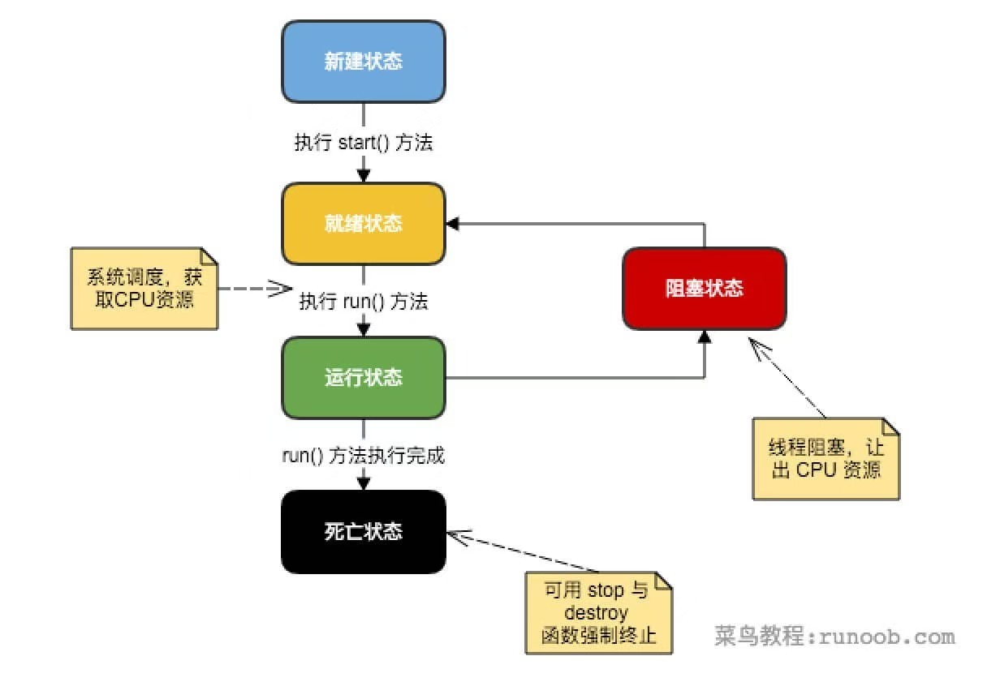

存在

1. **实现runnable接口**

2. **继承Thread类**（*最简单*）

3. **实现Callable接口**

三种方式来创建线程，在类中，**需要@Override重写run方法（线程执行方法）**


#### **12.1 run&start方法**

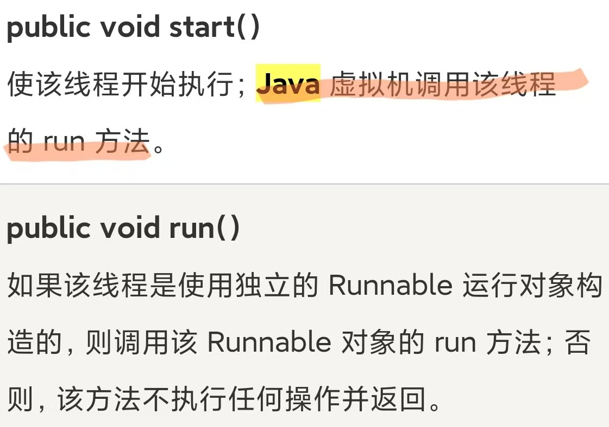

```java
// 定义线程类
class MyThread extends Thread {
    @Override
    public void run() {
        // 线程执行的代码
        System.out.println("Thread is running");
    }
}

// 调用线程时，利用start()方法启动线程
public class Main {
    public static void main(String[] args) {
        MyThread thread = new MyThread();
        thread.start(); // 启动线程
    }
}
```


#### **12.2 线程调度**

```java
Thread.yield()  // 暂停当前线程对象（让出CPU），执行其他进程
Thread.sleep(long millisec) // 线程对象睡眠指定毫秒时间
Thread.join() // 等待指定线程执行完毕
```


